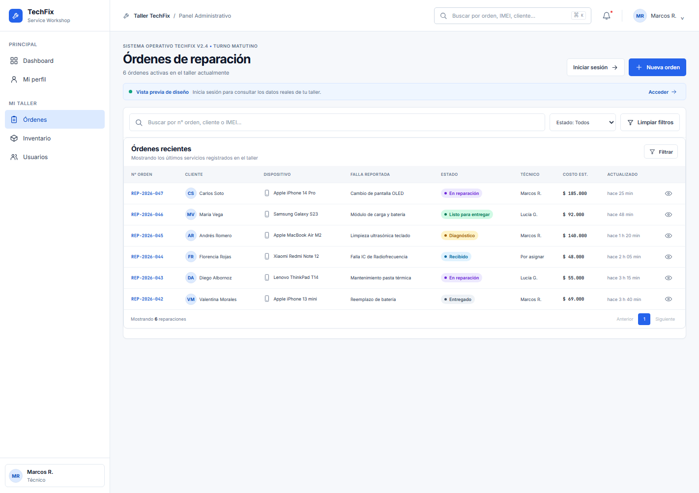
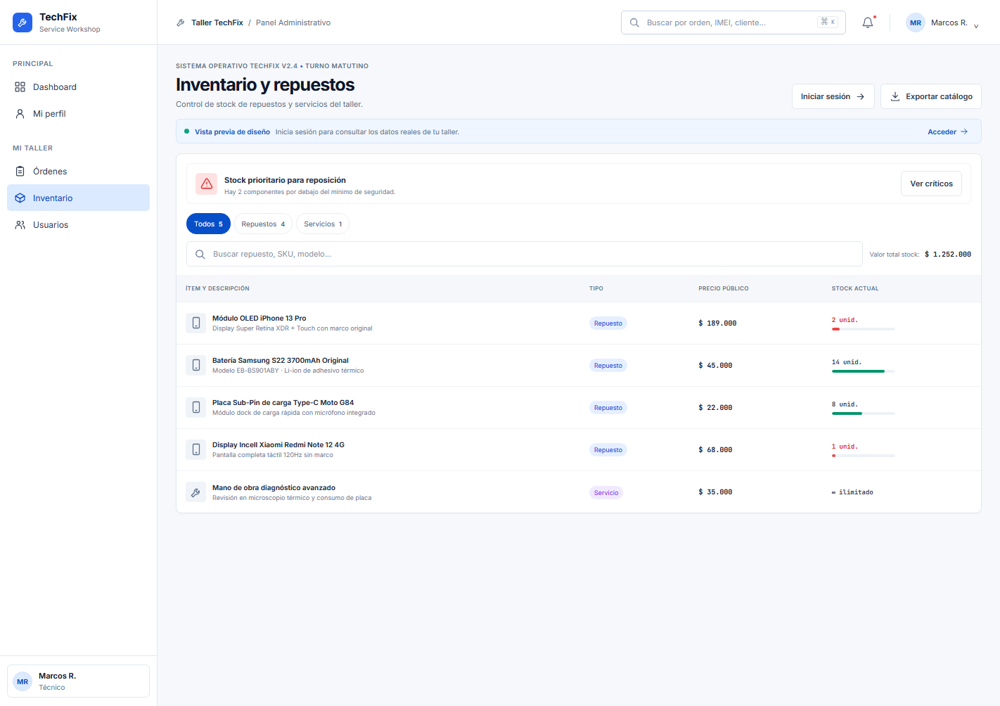

# TechFix - Sistema de Servicio Técnico

Aplicación web para gestionar reparaciones de dispositivos, inventario y usuarios de un taller técnico.

## Capturas de la interfaz

Estas capturas se tomaron con el frontend ejecutándose en el navegador. Muestran la interfaz en modo de demostración con datos de ejemplo; sirven como evidencia visual de las pantallas y la navegación, pero no representan datos reales ni confirman una conexión activa a PostgreSQL.

### Dashboard


### Órdenes de reparación



### Inventario y repuestos



### Detalle de una orden


## Tecnologías

- **Frontend**: React y Vite en `frontend/`
- **Backend**: Node.js y Express en `backend/`
- **Base de datos**: PostgreSQL
- **Despliegue**: Docker Compose

## Estructura

- `frontend/`: aplicación React y su configuración independiente.
- `frontend/legacy-client/`: interfaz anterior en HTML, CSS y JavaScript, conservada.
- `backend/src/`: API REST, organizada en controllers, services, DTOs y routes.
- `backend/database/`: scripts SQL de esquema y datos iniciales.
- `PLAN-DISENO-TECHFIX.md`: plan de diseño de la interfaz.

## Desarrollo local

1. Configura el backend:

```bash
Copy-Item backend/.env.example backend/.env
npm --prefix backend install
npm --prefix backend run dev
```

2. En otra terminal, inicia el frontend:

```bash
npm --prefix frontend install
npm --prefix frontend run dev
```

Vite muestra la URL local del frontend. La API usa `http://localhost:3000/api` por defecto. Puedes cambiarla con `VITE_API_URL` en `frontend/.env`.

## Docker Compose

```bash
docker compose up --build
```

Antes de iniciarlo, crea `backend/.env` desde `backend/.env.example` y configura `JWT_SECRET`. Docker Compose inicia PostgreSQL y el backend; para desarrollar la interfaz React, inicia Vite por separado con los comandos anteriores.
